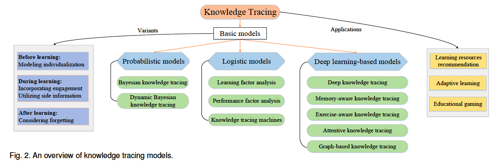

# KTM papers
Contributed by [Jiahao Chen](http://blog.tabchen.com).

## Introduction
Knowledge Tracing Model (KTM), which aims to monitor students’ evolving knowledge state, is an essential and crucial task to support these intelligent services. In this repo, we list some representative work on KTMs, and we use the taxonomy proposed in [1] to category those papers. Feel free to distribute or use it!

## Survey
1. **A Survey of Knowledge Tracing**. Qi Liu, Shuanghong Shen, Zhenya Huang, Enhong Chen, Yonghe Zheng. Preprint 2021. [[pdf](https://arxiv.org/abs/2105.15106)]

## Deep learning-based models
1. **EKT: Exercise-aware Knowledge Tracing for Student Performance Prediction**. Liu, Qi and Huang, Zhenya and Yin, Yu and Chen, Enhong and Xiong, Hui and Su, Yu and Hu, Guoping. IEEE TKDE 2021. [[pdf](http://staff.ustc.edu.cn/~huangzhy/files/papers/ZhenyaHuang-TKDE2021.pdf)] [[code](https://github.com/bigdata-ustc/ekt)] [[slide](http://staff.ustc.edu.cn/~huangzhy/files/slides/ZhenyaHuang-TKDE-slide.pdf)] (EKT/EERNN)
2. **Context-Aware Attentive Knowledge Tracing**. Aritra Ghosh, Neil Heffernan, Andrew S. Lan. KDD 2020. [[pdf](https://arxiv.org/pdf/2007.12324.pdf)] [[code](https://github.com/arghosh/AKT)] (AKT)
3. **Learning or Forgetting? A Dynamic Approach for Tracking the Knowledge Proficiency of Students**. Huang, Zhenya and Liu, Qi and Chen, Yuying and Wu, Le and Xiao, Keli and Chen, Enhong and Ma, Haiping and Hu, Guoping. TOIS 2020. [[pdf](http://staff.ustc.edu.cn/~huangzhy/files/papers/ZhenyaHuang-TOIS2020.pdf)] [[code](https://github.com/bigdata-ustc/EduKTM)] [[slide](http://staff.ustc.edu.cn/~huangzhy/files/slides/ZhenyaHuang-TOIS-slide.pdf)] (EKPT/KPT)
4. **Towards an Appropriate Query, Key, and Value Computation for Knowledge Tracing**. Youngduck Choi, Youngnam Lee, Junghyun Cho, Jineon Baek, Byungsoo Kim, Yeongmin Cha, Dongmin Shin, Chan Bae, Jaewe Heo. Preprint 2020. [[pdf](https://arxiv.org/pdf/2002.07033.pdf)] [[code](https://github.com/Shivanandmn/Knowledge-Tracing-SAINT)] (SAINT)
5. **Structure-based Knowledge Tracing: An Influence Propagation View**. Shiwei Tong, Qi Liu, Wei Huang, Zhenya Huang, Enhong Chen, Chuanren Liu, Haiping Ma, Shijin Wang. ICDM 2020. [[pdf](http://staff.ustc.edu.cn/~huangzhy/files/papers/ShiweiTong-ICDM2020.pdf)] [[slide](http://staff.ustc.edu.cn/~huangzhy/files/slides/ShiweiTong-ICDM2020-slide.pdf)] (SKT)
6. **Deep Knowledge Tracing with Side Information**. Zhiwei Wang, Xiaoqin Feng, Jiliang Tang, Gale Yan Huang, Zitao Liu. AIED 2020. [[pdf](https://arxiv.org/pdf/1909.00372.pdf)]
7. **RKT : Relation-Aware Self-Attention for Knowledge Tracing**. Shalini Pandey, Jaideep Srivastava. CIKM 2020. [[pdf](https://arxiv.org/pdf/2008.12736.pdf)] [[code](https://github.com/shalini1194/RKT)] (RKT)
8. **GIKT: A Graph-based Interaction Model for Knowledge Tracing**. Yang Yang, Jian Shen, Yanru Qu, Yunfei Liu, Kerong Wang, Yaoming Zhu, Weinan Zhang, Yong Yu. ECML-PKDD 2020. [[pdf](https://arxiv.org/pdf/2009.05991.pdf)] [[code](https://github.com/Rimoku/GIKT)] (GIKT)
9. **Graph-based Knowledge Tracing: Modeling Student Proficiency Using Graph Neural Network**. Hiromi Nakagawa, Yusuke Iwasawa, and Yutaka Matsuo. ICLR 2019. [[pdf](https://rlgm.github.io/papers/70.pdf)] [[code](https://github.com/jhljx/GKT)] (GKT)
10. **A Self-Attentive model for Knowledge Tracing**. Shalini Pandey, George Karypis. EDM 2019. [[pdf](https://arxiv.org/pdf/1907.06837.pdf)] [[code](https://github.com/arshadshk/SAKT-pytorch)] (SAKT)
11. **Addressing Two Problems in Deep Knowledge Tracing via Prediction-Consistent Regularization**. Chun-Kit Yeung,Dit-Yan Yeung. Preprint 2018. [[pdf](https://arxiv.org/pdf/1806.02180.pdf)] [[code](https://github.com/sulingling123/Knowledge_Tracing)] (DKT+)
12. **Dynamic Key-Value Memory Networks for Knowledge Tracing**. Jiani Zhang, Xingjian Shi, Irwin King, Dit-Yan Yeung. WWW 2017. [[pdf](https://arxiv.org/abs/1611.08108)] [[code](https://github.com/jennyzhang0215/DKVMN)] (DKVMN)
13. **Tracking Knowledge Proficiency of Students with Educational Priors**. Yuying Chen, Qi Liu, Zhenya Huang, Le Wu, Enhong Chen, Runze Wu, Yu Su, Guoping Hu. CKIM 2017. [[pdf](http://staff.ustc.edu.cn/~huangzhy/files/papers/YuyingChen-CIKM2017.pdf)] [[slide](http://staff.ustc.edu.cn/~huangzhy/files/slides/YuyingChen-CIKM2017-slide.pdf)]
14. **Deep Knowledge Tracing**. Piech, Chris and Spencer, Jonathan and Huang, Jonathan and Ganguli, Surya and Sahami, Mehran and Guibas, Leonidas and Sohl-Dickstein, Jascha. NeurIPS 2015. [[pdf](http://stanford.edu/~cpiech/bio/papers/deepKnowledgeTracing.pdf)] [[code](https://github.com/mmkhajah/dkt)] (DKT)

## Probabilistic models
1. **Dynamic bayesian networks for student modeling**. Tanja Kaser, Severin Klingler, Alexander G Schwing, and MarkusGross. IEEE 2017. [[pdf](https://ieeexplore.ieee.org/document/7889018)] [[code](https://github.com/IEDMS/BNT-SM)] (BNT-SM)
2. **Knowledge tracing:Modeling the acquisition of procedural knowledge**. Corbett, Albert T and Anderson, John R. UMUAI 1995. [[pdf](http://act-r.psy.cmu.edu/wordpress/wp-content/uploads/2012/12/893CorbettAnderson1995.pdf)] [[code](https://github.com/CAHLR/pyBKT)] (BKT)

## Logistic models
1. **Knowledge tracing machines: Factorization machines for knowledge tracing**. Vie, Jill-$J\hat{e}$nn and Kashima, Hisashi. AAAI 2019. [[pdf](https://arxiv.org/pdf/1811.03388.pdf)] [[code](https://github.com/jilljenn/ktm)] [[slide](http://jiji.cat/slides/aaai2019-ktm-slides.pdf)]
2. **Performance Factors Analysis--A New Alternative to Knowledge Tracing**. Pavlik Jr, Philip I and Cen, Hao and Koedinger, Kenneth R. Online Submission 2009. [[pdf](https://files.eric.ed.gov/fulltext/ED506305.pdf)]
3. **Learning Factors Analysis – A General Method for Cognitive Model Evaluation and Improvement**. Hao Cen, Kenneth Koedinger, Brian Junker. ITS 2006. [[pdf](https://citeseerx.ist.psu.edu/viewdoc/download?doi=10.1.1.297.2141&rep=rep1&type=pdf)]

## Variants
1. **SAINT+: Integrating Temporal Features for EdNet Correctness Prediction**. Dongmin Shin, Yugeun Shim, Hangyeol Yu, Seewoo Lee, Byungsoo Kim, Youngduck Choi. Preprint 2021. [[pdf](https://arxiv.org/pdf/2010.12042.pdf)] [[code](https://github.com/Shivanandmn/SAINT_plus-Knowledge-Tracing-)] (SAINT+)
2. **Improving Knowledge Tracing via Pre-training Question Embeddings**. Yunfei Liu, Yang Yang, Xianyu Chen, Jian Shen, Haifeng Zhang, Yong Yu. IJCAI 2020. [[pdf](https://www.ijcai.org/proceedings/2020/0219.pdf)] [[code](https://github.com/ApexEDM/PEBG)] (PEBG+DKT/DKVMN etc.)
3. **Convolutional Knowledge Tracing: Modeling Individualization in Student Learning Process**. Shuanghong Shen, Qi Liu, Enhong Chen, Han Wu, Zhenya Huang, Weihao Zhao, Yu Su, Haiping Ma, Shijin Wang. SIGIR 2020. [[pdf](http://staff.ustc.edu.cn/~huangzhy/files/papers/ShuanghongShen-SIGIR2020s.pdf)] [[code](https://github.com/shshen-closer/Convolutional-Knowledge-Tracing)] [[slide](http://staff.ustc.edu.cn/~huangzhy/files/slides/ShuanghongShen-SIGIR2020s-slide.pdf)] (CKT)
4. **Augmenting Knowledge Tracing by Considering Forgetting Behavior**. Koki Nagatani, Qian Zhang, Masahiro Sato, Yan-Ying Chen, Francine Chen, and Tomoko Ohkuma. WWW 2019. [[pdf](https://dl.acm.org/doi/10.1145/3308558.3313565)] (DKT-Forget)
5. **Modeling Exercise Relationships in E-Learning: A Unified Approach**. Haw-Shiuan Chang, Hwai-Jung Hsu, Kuan-Ta Chen. EDM 2015. [[pdf](https://www.educationaldatamining.org/EDM2015/uploads/papers/paper_47.pdf)]
6. **Tracing knowledge and engagement in parallel in an intelligent tutoring system**. Sarah Schultz and Ivon Arroyo. EDM 2014. [[pdf](https://citeseerx.ist.psu.edu/viewdoc/download?doi=10.1.1.660.7143&rep=rep1&type=pdf)] (KAT)
7. **General Features in Knowledge Tracing:Applications to Multiple Subskills,Temporal Item Response Theory, and Expert Knowledge**. Gonz{\'a}lez-Brenes, Jos{\'e} and Huang, Yun and Brusilovsky, Peter. EDM 2014. [[pdf](http://d-scholarship.pitt.edu/26017/1/84_EDM-2014-Full.pdf)] (FAST)

## Applications
1. **Adapting Bayesian knowledge tracing to a massive open online course in edX**. Zachary A. Pardos, Yoav Bergner, Daniel T. Seaton, David E. Pritchard. EDM 2013. [[pdf](https://citeseerx.ist.psu.edu/viewdoc/download;jsessionid=BED5683A82171EE8E7E8DB2E095319F5?doi=10.1.1.668.6548&rep=rep1&type=pdf)]

## Other
1. **Federated Deep Knowledge Tracing**. Jinze Wu, Zhenya Huang, Qi Liu, Defu Lian, Hao Wang, Enhong Chen, Haiping Ma and Shijin Wang. WSDM 2021. [[pdf](http://staff.ustc.edu.cn/~huangzhy/files/papers/JinzeWu-WSDM2021.pdf)] [[slide](http://staff.ustc.edu.cn/~huangzhy/files/slides/JinzeWu-WSDM2021-slide.pdf)]
2. **Learning Process-consistent Knowledge Tracing**. Shuanghong Shen, Enhong Chen, Qi Liu, Zhenya Huang, Wei Huang, Yu Yin, Yu Su, Shijin Wang. KDD 2021. [[pdf](http://staff.ustc.edu.cn/~huangzhy/files/papers/ShuanghongShen-KDD2021.pdf)] [[code](https://github.com/bigdata-ustc/EduKTM)] [[slide](http://staff.ustc.edu.cn/~huangzhy/files/slides/ShuanghongShen-KDD2021-slide.pdf)] [[video](https://www.bilibili.com/video/BV1jg41157UX/)]

## References
[1]:**A Survey of Knowledge Tracing**. Qi Liu, Shuanghong Shen, Zhenya Huang, Enhong Chen, Yonghe Zheng.